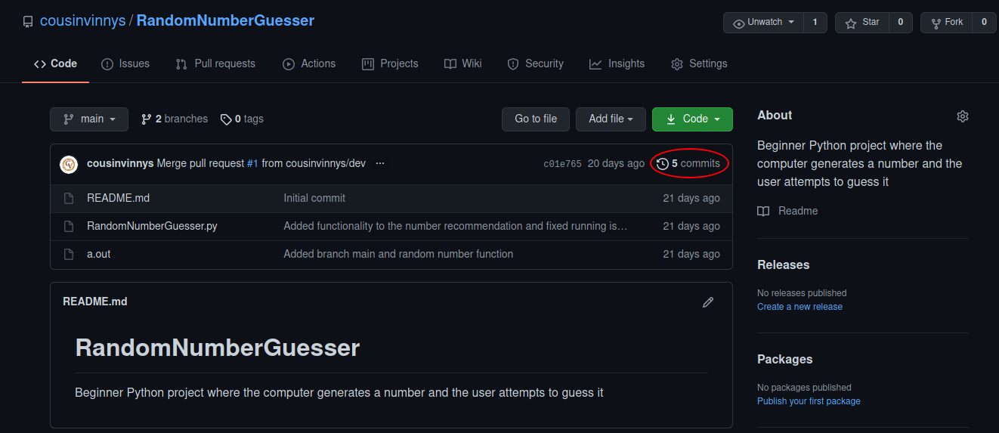

# PGG's Git Crash Course: How to 'git' good

~Christian Peters

## What is git?

Something that is all too common with us nerds who work with computers is that we make mistakes. _A LOT_. In fact, it wouldn't be too far off to define working with software "a constant evolving problem that never goes away". However, when you solve that problem, it's all the more sweet.

But when you're working with code that is also constantly evolving and changing, it's important to keep track of your work. Everyone has been working on a coding project, added a function and then had everything break. I know I've been there. When that happened, I would have killed to have something that would have kept track of my routine "backups" of my code. Enter git.

As we have referenced a lot in this guide, let's see what Dr. Wikipedia has to say:

> Git is software for tracking changes in any set of files, usually used for coordinating work among programmers collaboratively developing source code. ([Wikipedia](https://en.wikipedia.org/wiki/Git))

Basically, to boil down the boiled down version of git, it is a complex remote integrated system restore. If you've ever used Windows, you know that making a system restore point enables your computer to completely revert back to that certain point when something bad happened. You downloaded a virus from a Minecraft mod website, but never fear, Windows made a restore point to save your computer and act like that malicious software never existed. This is the same concept that is applied to git, but with code.

## Breaking it down

Fun fact: the guy who invented Linux also invented git. Yeah, mega nerd. Anyways, since he so kindly blessed us with git _and_ Linux, git works remarkably well through the command line. In our personal usage of git through our job, there really is only a handful of commands that we use on a daily basis. The rest is just Google and insert.

Let's quickly go over some of the core commands that we use on a daily basis. I would highly recommend having a [git cheat sheet](https://www.reddit.com/r/git/comments/5m5fdz/git_cheat_sheet/) on hand when working with git. I've been personally using git for a few weeks and I _still_ have to use a cheat sheet because I have a goldfish memory and forget everything.

### Git Structure

Before we jump head first into commands, lets cover the structure of git. The name for a git file system is a _repository_ or as us nerds call it: _a repo_. This repo can be local or remote, and is a storage container for all of your changes and modifications that you do to the git tree. The 'git structure' is divided into three subsections: the working tree, the staging area, and the history. This helped me a lot conceptually when I was first starting with git. Essentially, it works like this:

- Your working tree is your current batch of files you're working on and editing.
- You take that working tree, and add it to the staging area. This is when you can purposefully omit files you don't want to "track" or have snapshots of.
- You then commit that staging area to your commit history, meaning you have a saved snapshot of this version of the code to reference back to if needed.

### Adding

Like referenced above, your first step in "taking a snapshot" of your code is adding your newly modified files to your staging area. You can accomplish this by the following command:

- `git add [files]`

NOTE: To add all files in a given directory, you can use `git add .`, which I like to use.

### Committing

Next up after you've added your files is committing. Committing is essentially making a "System Restore point" for your code. It takes a snapshot of your code, and stores it in the code commit history for you to reference at any time.

Useful commands:

- `git commit -a -m "Description of commit"`

### Pushing

This gets into the real power of git. Git can be used locally as a personal version control system, but the real fun is when it is used remotely through clients like GitHub and GitKraken. Keep in mind, git and GitHub and GitKraken are NOT the same (yes, I thought they were once). Git is the version control software itself, and GitHub/GitKraken are remote websites that help with remote management, as well as offer a ton of other cool features to aid in collaboration and productivity. We'll touch more on GitHUb later, but just acknowledge that it exists.

Pushing your changes to a remote branch essentially means that you are proposing an update to a given branch based on the commits you have made locally through adding and staging your modifications. In order to push properly, you need to set a target remote branch. To do this, the command is:

- `git branch --set-upstream-to origin`

This command sets your current branch to "push" to origin, meaning that when you use the next command, it will update the remote branch as well. This push command is used like this:

- `git push origin`

You might have to also use this command to push to the HEAD, which is a pointer to the current remote branch (fact check)

- `git push origin HEAD`

By pushing your commits and changes to a remote branch, you are enabling other users who have access to your repo to view your changes and give feedback accordingly.

### Pulling

This is the opposite of pushing. When someone has made a change to a remote branch (or you have made a change to a branch on another system) you can simply update your _local_ repo by pulling in the changes from the remote branch. This can be done by

- `git pull`

BIG HUMONGUS NOTE: `git pull` and A PULL REQUEST are two different things! Yes, I made this mistake when I first started out so it's ok.

### A Pull Request

So you've been hard at work on a branch of code, and now you think that your version of the code should be worked into the main working branch. In this situation, you would open a Pull Request in GitHub. This essentially requests the owners of the master branch to "pull" your changes into the master branch. In the pull request dialog box, state your changes and mention how your code is stable and should be worked into the main version.

### Branching

Git works like a tree, where everyone working on a project can be responsible for their own branch. Thing is, in this tree, you can merge your branches back into the theoretical "trunk" or main branch of the project. Basically, you can go and make changes to the code, but not interrupt the core, working version of the code. However, when your changes are secure and deemed stable, you can merge it back and the main version gets updated.

Useful commands:

- `git branch`: Shows a list of branches, and what branch you are currently on
- `git branch [name]`: Creates a new branch
- `git checkout [name]`: Switches your current working branch

Glance over this page about [a successful Git branching model](https://nvie.com/posts/a-successful-git-branching-model/) to see visually what I'm talking about here.

### Other useful git Commands

While using git on a day to day basis, the previous commands will 'git' you started, but won't be everything you'll need. Here are some other commands that will help you develop and see your progress along the way: https

- `git clone [URL TO CLONE FROM]`: Probably the most important out of all the "other" commands. This will copy the code on the specified branch from a remote repo, most of the time on GitHub.
- `git status`: Shows you what files have been modified in the current directory and what files have been added to the staging area.
- `git log`: A record of all of your git commits
- `git rm`: Remove a file from the git repo

## GitHub, GitKraken, what exactly do I Git here?

Like I mentioned earlier, git is merely the software that manages the commit history. GitHub and GitKraken add a ton more features and accessibility to the git skeleton. Like git itself, I would recommend having a [GitHub git cheat sheet](https://training.github.com/downloads/github-git-cheat-sheet/) on hand, as all of this stuff can be overwhelming.

### GitHub

Let's see what Dr. Wikipedia has to say for a definition, shall we?

> GitHub, Inc. is a provider of Internet hosting for software development and version control using Git. It offers the distributed version control and source code management (SCM) functionality of Git, plus its own features. It provides access control and several collaboration features such as bug tracking, feature requests, task management, continuous integration and wikis for every project. ([Wikipedia](https://en.wikipedia.org/wiki/GitHub))

GitHub is the largest host of source code on the globe. If it's open source, it's probably on GitHub.

### Ok, what makes it so special?

GitHub lets you track your changes and commits, and also lets you comment, complain and praise anything you want through the interface. You can highlight issues, bring up complaints, start checklists, organize to-do lists, and so much more. To avoid a 30 page discussion on GitHub, lets jump into what WE use it for.

### Tracking Issues

### Assigning Teams

One of GitHub's fancy functions is to add members of a team to work on a project. You can assign people by simply clicking on the "Assignees" button in GH. You can assign people to projects, issues and more simply by clicking.

### Commit history

You can view your commit history in a nice GUI on GitHub. You can view your commit history by clicking the "commits" button in the repo.

### Project Board

## An Example Workflow

Say I just sat down to my desk in the morning and I want to start working on a project. Here's my normal process of commands that I enter to get set up:

- `git clone [URL TO CLONE FROM]`: This sets up a local version of the repo on my system, with "origin" automatically pointing remotely to GitHub (fact check?)
- Change directories to the repo
- `git pull`: Updates the repo to any more changes that may have been made

_Do a little work, pick your nose, whatever_

- `git status`: Seeing what files I modified and what I need to add to my staging area
- `git add [FILENAME]`: Adds the "untracked" files to my staging areas
- `git status`: Verifying that the files got added to the staging area
- `git commit -am "COMMENT ON CODE`: Stores my recent changes into a commit with that label

_Do more work, commits and stuff, and then after I have made my final commit of the day_

- `git push`: Pushes my changes to the remote branch, and I'm done for the day
